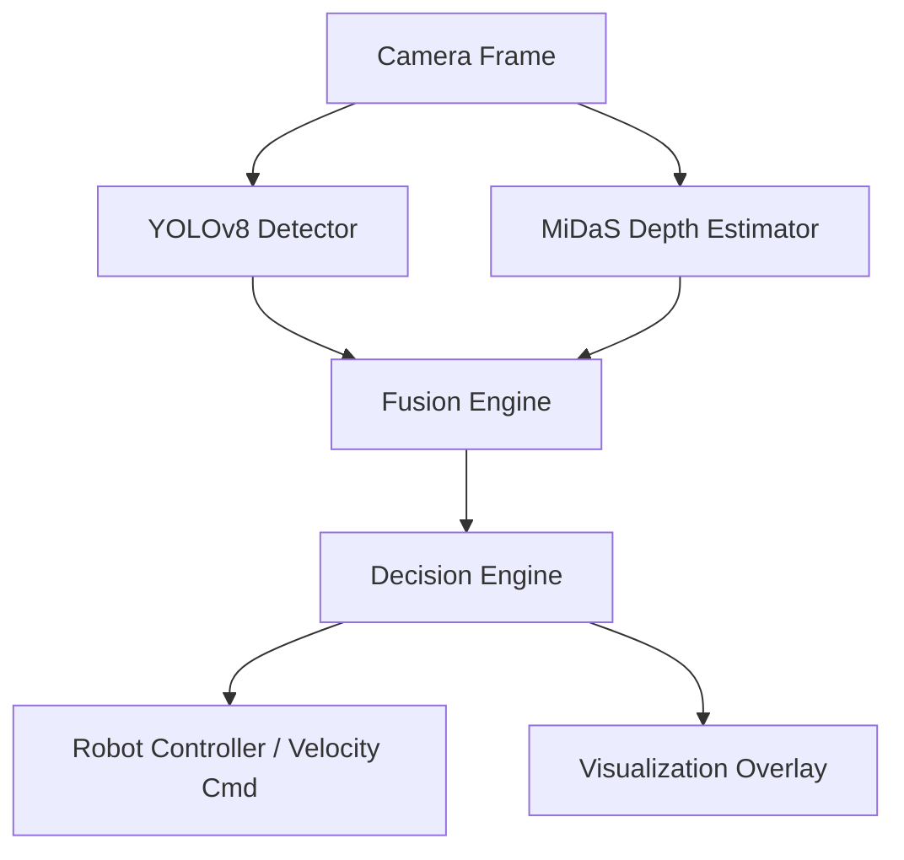

# Depth-Aware Robot Navigation and Collision Avoidance System

## Soft Computing Mini Project: Fuzzy Logic Enhanced Navigation

This project demonstrates soft computing principles by incorporating **Fuzzy Logic** into the decision-making process for autonomous navigation. The fuzzy logic system handles uncertainty in obstacle risk assessment, providing more adaptive and human-like decision making compared to traditional crisp threshold approaches.

### Fuzzy Logic Features:
- Fuzzy sets for risk levels (low, medium, high)
- Fuzzy rules for action selection
- Defuzzification for crisp action outputs
- Improved handling of sensor noise and environmental uncertainty

## Problem Statement
Autonomous robots must reliably perceive their environment, detect obstacles, and navigate without collisions. Standard 2D object detection provides identifying information (what objects are present) but lacks vital 3D spatial awareness (how far away they are). This restricts effective decision-making in dynamic environments. 

## Approach
This project solves the above problem by creating a unified pipeline integrating 2D Object Detection (YOLOv8) with Monocular Depth Estimation (MiDaS). 
- **YOLOv8** extracts real-time bounding boxes and semantic classes (e.g., person, chair).
- **MiDaS** generates a dense depth map for every frame.
- A **Fusion Engine** maps the bounding boxes onto the depth map to extract reliable object distance and spatial positioning (left, center, right).
- A **Decision Engine** analyzes the obstacles, calculates risk scores, and delegates high-level actions (`MOVE_FORWARD`, `TURN_LEFT`, `STOP`) mapped to robot velocity commands.

## Architecture Diagram


## Setup Instructions
1. Clone the repository and navigate to the project root `depth_nav`.
2. Ensure you have Python 3.10+ installed.
3. Install requirements:
   ```bash
   pip install -r requirements.txt
   ```
4. The initial run will automatically download MiDaS and YOLOv8 weights to your torch/ultralytics cache.

## How to Run
- **On a Webcam (via USB or integrated)**
  ```bash
  cd scripts
  python run_pipeline.py --source 0
  ```
- **On a Video File**
  ```bash
  cd scripts
  python run_pipeline.py --source path_to_video.mp4
  ```
- **On a Phone Camera (iPhone / Android) via Wi-Fi**
  You can stream directly from your phone to your laptop's robot inference system in real-time. No code changes are required since the system dynamically parses IP camera URLs.
  1. Download an IP Webcam app on your phone (e.g., **IP Webcam** for Android or **DroidCam / EpocCam** for iPhone).
  2. Ensure your phone and laptop are on the exact same Wi-Fi network.
  3. Start the server on the phone app. It will display a network URL (like `http://192.168.1.100:8080`).
  4. Run the pipeline passing the video HTTP endpoint:
  ```bash
  cd scripts
  python run_pipeline.py --source "http://192.168.1.100:8080/video"
  ```

## Evaluation Metrics Details
- **Collision Avoidance Rate**: To measure this mathematically, one could log cases where `robot_distance_to_obstacle < threshold` but no `STOP` command was fired.
- **Decision Accuracy**: Precision of predicting `TURN_LEFT` when only left is clear versus ground truth human commands.
- **FPS Performance**: Tracked dynamically using `utils/helpers.py:FPSCounter` directly on the screen output and printed out via the main evaluation when the process terminates.

## Future Improvements
- **Object Tracking:** Integrating DeepSORT or SORT to track obstacles over subsequent frames could improve time-to-collision estimation and temporal stability.
- **Sensor Fusion:** In real-world robots, fusing physical LiDAR or ultrasonic sensors with standard camera depth provides a more metric-accurate approach.
- **ROS2 Native Implementation:** Porting this Python pipeline into a dedicated ROS2 node architecture using pub/sub topics (`sensor_msgs/Image`, `geometry_msgs/Twist`).
